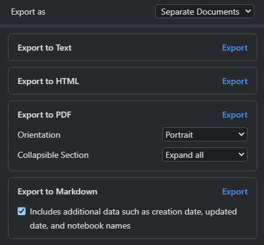
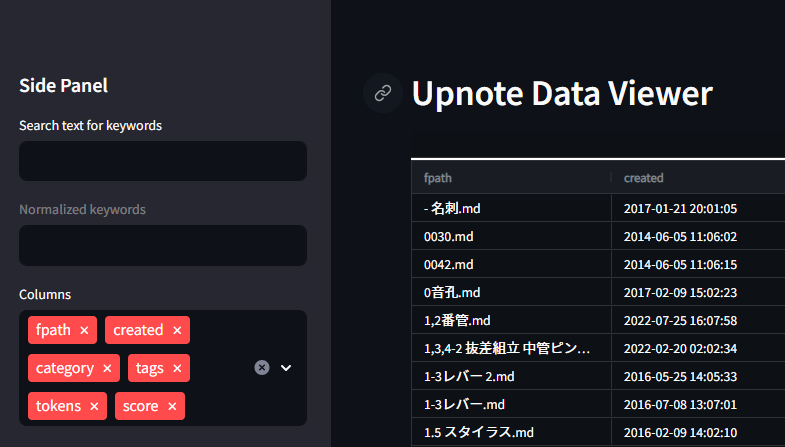

UpNote Markdown Manager
===

yoshinobu ishizaki

## Abstract

Several scripts to manage markdown notes from UpNote.

## Data

1. Export your UpNote data with "export as markdown".
   - Select "Separate Documents"
   - Check "Includes additional data..." 

    

2. Place all of your data into "UpNote" folder.

    `UpNote/General Space/...`

## Preparation

### Convert data to dataframe

1. Run [01_df-creation.py](script/01_df-creation.py) to generate `upnote_text.csv`
2. Place `upnote_text.csv` under `data` folder.
3. Run [02_splitwords.py](script/02_splitwords.py) to generate `data/upnote_text_split.csv`.

## Keyword Search

Run [keyword_search.py](keyword_search/keyword_search.py) for keyword search of notebook. Streamlit web interface will launched.

This web interface reads `upnote_text.csv` and `upnote_text_split.csv` both.

